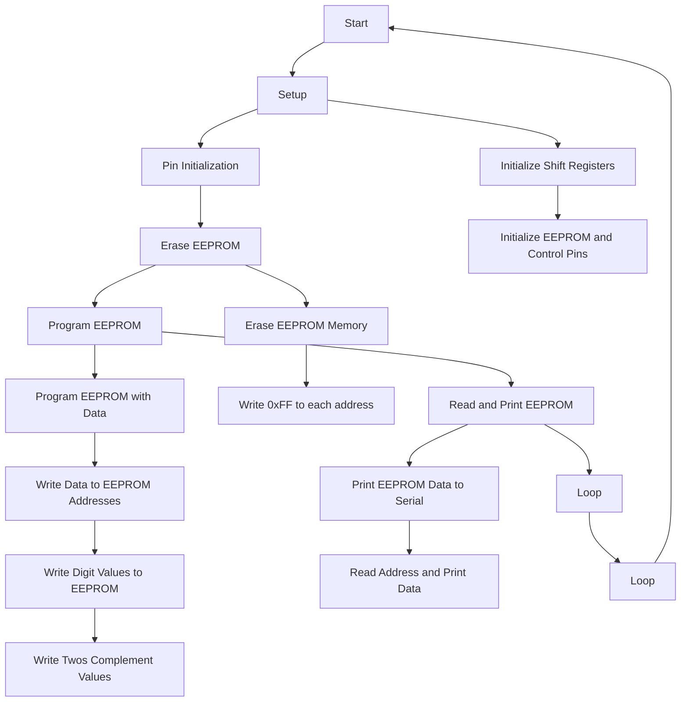

```mermaid
graph TD
    A[Start] --> B[Setup]
    B --> C[Pin Initialization]
    C --> D[Erase EEPROM]
    D --> E[Program EEPROM]
    E --> F[Read and Print EEPROM]
    F --> G[Loop]

    B --> H[Initialize Shift Registers]
    H --> I[Initialize EEPROM and Control Pins]

    D --> J[Erase EEPROM Memory]
    J --> K[Write 0xFF to each address]

    E --> L[Program EEPROM with Data]
    L --> M[Write Data to EEPROM Addresses]
    M --> N[Write Digit Values to EEPROM]
    N --> O[Write Twos Complement Values]

    F --> P[Print EEPROM Data to Serial]
    P --> Q[Read Address and Print Data]

    G --> R[Loop]
    
    R --> A[Start]

```
