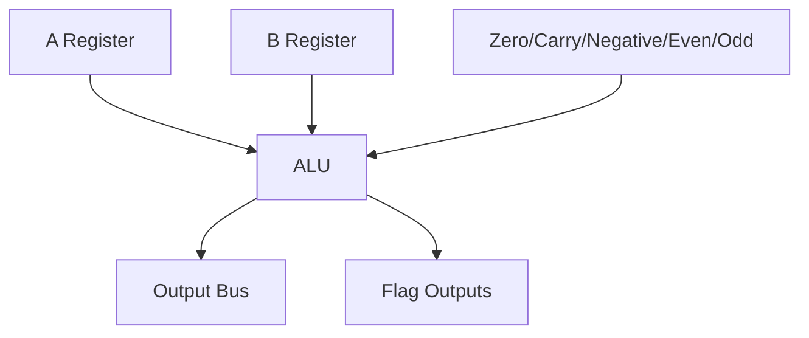

```mermaid
graph TD
    AInput[A Register] --> ALU
    BInput[B Register] --> ALU
    Flags[Zero/Carry/Negative/Even/Odd] --> ALU
    ALU --> Result[Output Bus]
    ALU --> FlagsOut[Flag Outputs]
```