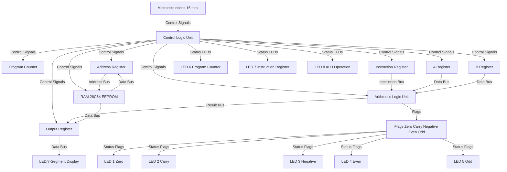

```mermaid
graph TD
    A[Microinstructions 16 total] -->|Control Signals| CLogic[Control Logic Unit]
    CLogic -->|Control Signals| PC[Program Counter]
    CLogic -->|Control Signals| IR[Instruction Register]
    CLogic -->|Control Signals| AddrReg[Address Register]
    CLogic -->|Control Signals| RAM[RAM 28C64 EEPROM]
    CLogic -->|Control Signals| AReg[A Register]
    CLogic -->|Control Signals| BReg[B Register]
    CLogic -->|Control Signals| ALU[Arithmetic Logic Unit]
    CLogic -->|Control Signals| Output[Output Register]

    AddrReg -->|Address Bus| RAM
    IR -->|Instruction Bus| ALU
    AReg -->|Data Bus| ALU
    BReg -->|Data Bus| ALU
    ALU -->|Result Bus| Output
    RAM -->|Data Bus| Output
    RAM -->|Data Bus| AddrReg

    ALU -->|Flags| Flags[Flags Zero Carry Negative Even Odd]
    
    Output -->|Data Bus| Display[LED/7-Segment Display]


    Flags -->|Status Flags| LED1[LED 1 Zero]
    Flags -->|Status Flags| LED2[LED 2 Carry]
    Flags -->|Status Flags| LED3[LED 3 Negative]
    Flags -->|Status Flags| LED4[LED 4 Even]
    Flags -->|Status Flags| LED5[LED 5 Odd]
    CLogic -->|Status LEDs| LED6[LED 6 Program Counter]
    CLogic -->|Status LEDs| LED7[LED 7 Instruction Register]
    CLogic -->|Status LEDs| LED8[LED 8 ALU Operation]

```
